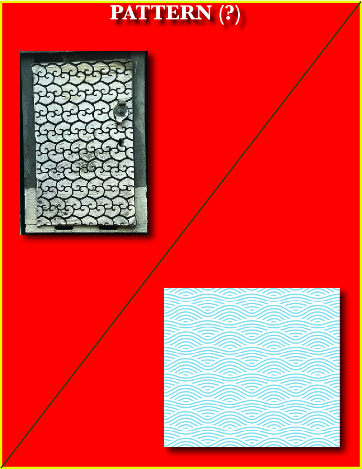

# DOPPIA F

Doppia F si presenta come un'installazione galleggiante che trasforma l'energia solare e il moto ondoso in suono e luce invitando le persone a una esperienza collettiva multisensoriale.
La superficie dell'installazione è calpestabile e rivestita da celle fotovoltaiche organiche trasparenti e semi-flessibili. Queste, oltre a generare energia pulita dal sole, permettono la visione del moto ondoso sottostante, creando un'esperienza immersiva. Con dei sensori di pressione distribuiti sulla superficie della piattaforma si rilevano il peso e il movimento dei visitatori. Più persone si muovono insieme sulla piattaforma, più l'installazione genera una melodia diffusa da altoparlanti subacquei e/o aerei o cambia colore grazie a dei led integrate nell'installazione e in base all' intensità dell' interazione, creando un senso di responsabilità collettiva facendoci prendere coscienza del peso delle nostre azioni. Si creerebbe, di sera, una sorta di Faro.
Sotto la piattaforma sono installate delle turbine biomimetiche e membrane filtranti. L'energia solare in eccesso viene utilizzata per alimentare un dissalatore a impatto zero offrendo acqua potabile gratuita alle persone, accessibile grazie ad una Fontana sulla terraferma adiacente all' installazione, sensibilizzando sul tema della scarsità idrica.

 .

[Scarica la foto](docs/pattern.jpg)
